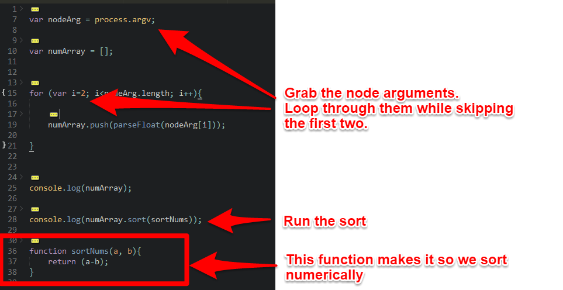
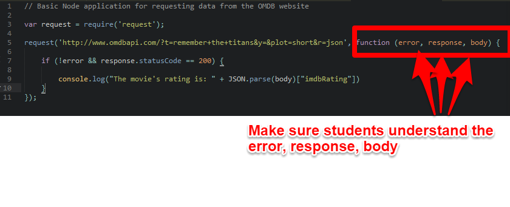
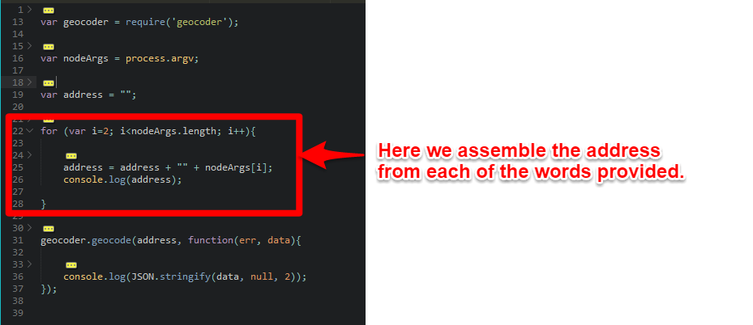
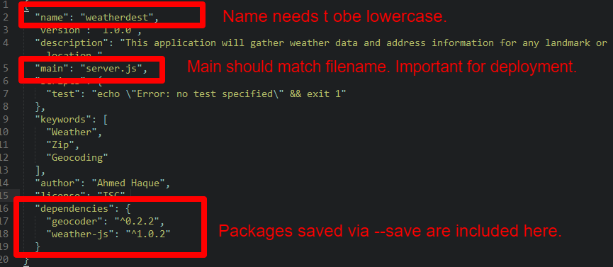
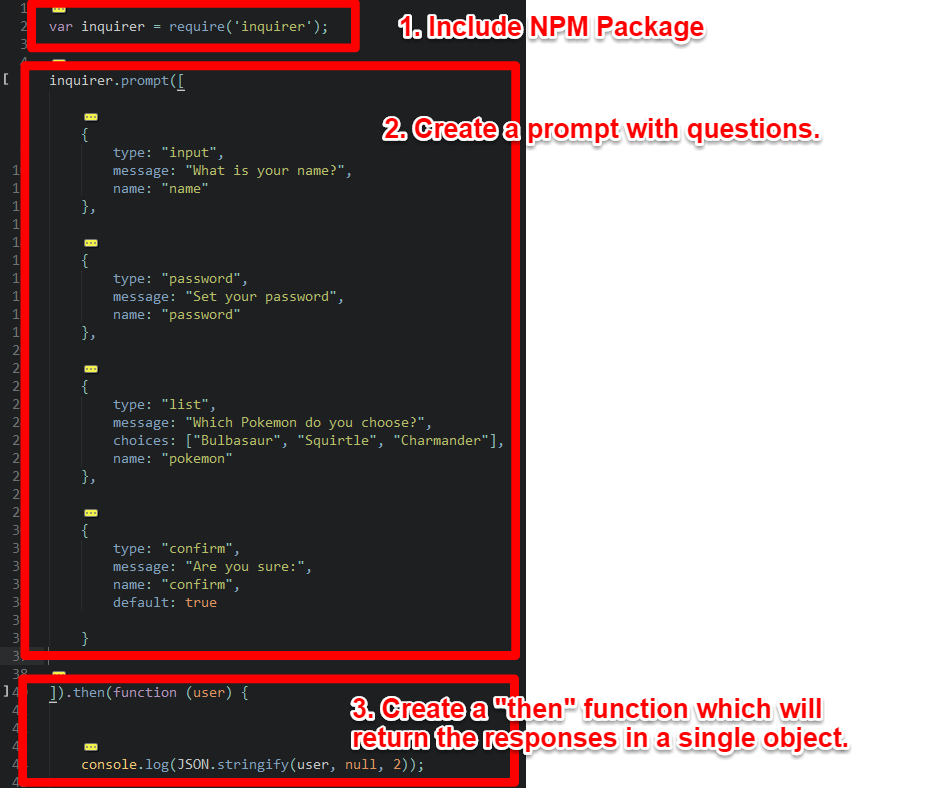
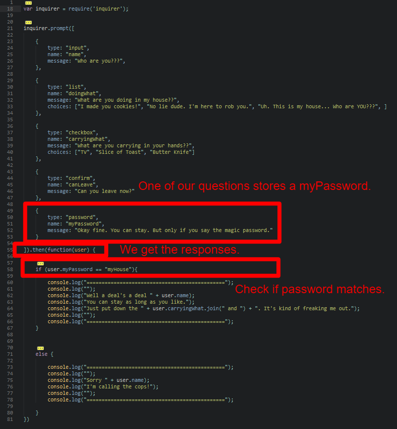
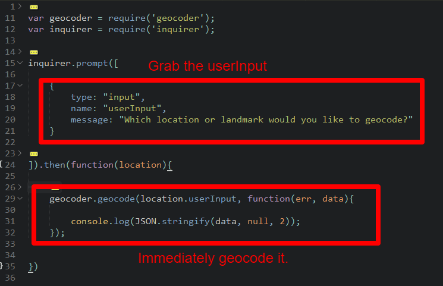
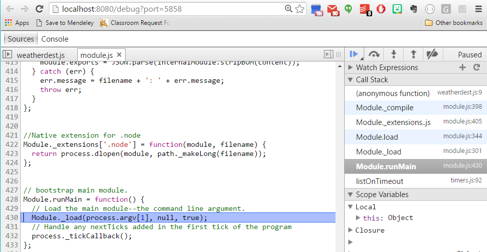

## Day 5 - The Power of Packages <!--links--> &nbsp; [⬅️](../04-Day/04-Day-LessonPlan.md) &nbsp; [➡️](../../06-Week/01-Day/01-Day-LessonPlan.md)

### Overview

In this class, we will be introducing students to the concept of NPMs and package management. Most notably, we will be introducing students to inquirer.js -- an NPM package for building command line applications which are more capable of taking in user inputs than `process.argv` is.

`Summary: Complete Activities 20-29 in Unit 10`

##### Instructor Priorities

* Students should understand the utility of NPM packages and the process for including them in Node applications.
* Students should understand how to use the `inquirer.JS` NPM package for handling user inputs on the command line.

##### Instructor Notes

* Today's class is incredibly important for both students' immediate homework assignment and their broader proficiency as Node developers. It is of the utmost importance that the majority of your students walk out understanding:

  * What an NPM package is

  * How to install NPM packages

  * Why NPM Packages are useful

  * How to create and use a `package.json` file for managing packages

* The second major goal of today's class is on building their proficiency with the `inquirer.js` package. This will be a package they use frequently, so do whatever necessary to ensure that the majority of your students can use the package in its basic form.

* If `inspect-process` doesn't work well for you or your students, don't sweat it. Students can always use the alternate approach of `console.log`ging for future debug needs.

* Have your TAs reference [Day-5-TimeTracker](Day-5-TimeTracker.xlsx) to help keep track of time during class.

### Sample Class Video (Highly Recommended)
* To view an example class lecture visit (Note video may not reflect latest lesson plan): [Class Video](https://codingbootcamp.hosted.panopto.com/Panopto/Pages/Viewer.aspx?id=c2ee5062-451f-46fb-a693-a86200fbdbb2)

- - -

### Class Objectives

* To introduce students to the concept of NPM and the process for including new packages.
* To introduce students to inquirer.js, an NPM package for building responsive command line applications.

- - -

### 1.	Instructor Do: Welcome Students	(1 min)

* Spend a minute welcoming students back to class before jumping straight into the first activity.

### 2.	Students Do: CommandSort Refresher	(15 mins)

* Slack out the following:

* **Files:**

  * `commandSortUnsolved.js` (`20-CommandSort > UNSOLVED`)

* **Instructions:**

  * Starting from a blank file, create a Node-based command-line application that takes in a series of numbers from the user and returns the numbers sorted in ascending order.

  * Note: Feel free to use Stack Overflow or Google to find the code for sorting integers numerically.

### 3.	Instructor Do: Review CommandSort	(5 mins)

* Review the solution with your students. In discussing the solution be sure to mention the following:

  * The use of `process.argv` to hold all of the arguments.

  * The conversion of the arguments into an array using a for-loop. Note how the for-loop skips the first two Node arguments.

  * The use of the JavaScript `.sort` method with an associated function that specifies how the sort should work.
    

* Then slack out the solution and proceed to the next example.

### 4.	Instructor Do: Request Refresher	(7 mins)

* For this example, open the file `omdbRequest.js` (`21-RequestRefresher`). This file is an exact replica of the code from the last class.

* Ask students to explain what the code is doing and how it works. Specifically ask students where the arguments `error`, `response`, and `body` are coming from.

  * ANSWER: The `request` function creates them.

* Then run the code to remind students what the code does.

* Once you feel confident that the majority of students understand it, Slack out the code and proceed to the next example.

### 5.	Instructor Do: Visit NPM and Explain 	(10 mins)

* Ask students how we installed the `request` package from the last example (Answer: We ran `npm install request`).

* Then ask them to explain what NPM is.

  * ANSWER: NPM stands for Node Package Manager. It allows us to quickly incorporate pre-made code snippets into our Node applications.

* Then visit the NPM page <https://www.npmjs.com/browse/star> and show the class how the NPM website lists all of the node packages available for inclusion.

* Do a quick search for "request" and show them that page. <https://www.npmjs.com/package/request>. Point out how the page offers a README on how to use the package as well as provides basic information on the download statistics. Let them know that packages with more users are obviously more reliable than those with only a few downloads.

* Then do a quick search for other NPM packages like "Twitter" or "Spotify". Again, show students how each of these packages each have their own README which lists out how to use the package and provide users with a few examples.

* Finally ask students to explain back to you why a standard library like NPM is so useful to developers.

  * ANSWER: It gives us a giant arsenal of pre-made code that can speed up our development by leveraging the work of others. Copy-paste coding at its very best.

* Once you feel comfortable with your students' understanding, proceed onto the next example.

### 6.	Instructor Do: Weather NPM	(10 mins)

* For this example, do an NPM search for "weather-js"

  * NOTE: Be sure to search for "weather-js" and not just "weather" as they will bring up different packages

* Explain that this node package will allow us to quickly collect a weather report on a given city or zipcode.

* Then open the file `weather.js` (`22-WeatherNPM`).

* Quickly walk students through the code at an abstract level before pointing out that it will not work until you complete one critical step. Ask them what that step is.

  * ANSWER: Run `npm install weather-js`.

* Run `npm install weather-js` in the folder.

* Then proceed to run the application using `node weather.js` in Terminal or Git Bash. Enter a city of your choice and show how the application returns a JSON of weather data.

* Finally, return to the code and walk students through it. In discussing the code, be sure to point out:

  * The inclusion of the `weather-js` package using require

  * The `weather.find` method which takes in a city, the units of measure, and a variable to hold the results (in this case the variable is `result`).

  * The `JSON.stringify` method which takes in the results and "pretty-prints" it.

    * NOTE: the "2" argument specifies the spacing of the JSON data

    

* Wait for questions, before proceeding to slack out the code to students.

### 7.	Partners Do: Review Weather NPM	(5 mins)

* Ask students to review the code with the person next to them.

* Then ask students to explain how the code works back to you. Try to ask pointed questions if you can.

* When you feel comfortable with their understanding, proceed onto the next exercise.

### 8.	Students Do: Geocode NPM	(20 mins)

* Then open the folder `04-GeocodeNPM` and run `node geocodeChallenge.js`.

* When prompted, enter a city (Austin, TX) or landmark (The White House). Explain to students that the code returns a JSON object that geocodes the location. Explain that this information is very useful when building map-based applications.

* Let them know that they will be building this application over the next 20 minutes.

* Slack out the following file and instructions:

* **File:**

  * `geocode.js` (`23-GeocodeNPM > UNSOLVED`)

* **Instructions:**

  * Create a Node application which makes use of the "geocoder" NPM package to obtain detailed geocoding information about a location.

  * Then `console.log` the geocoding information to display in your terminal.

  * You can choose to make one of two assumptions when completing this application.

    * Easier Option: The user will always provide a location in the following format: "City, State" (example: "Atlanta, GA", "Houston, TX").

    * Harder Option: The user can provide a location in any format. In fact, they can even provide a landmark instead of an address. ("151 Sip Ave, Jersey City NJ", "The Eiffel Tower", etc.)

  * Remember to log the output using `JSON.stringify` in a pretty-print format.

### 9.	Instructor Do: Review Geocode NPM	(7 mins)

* Review the solutions for students starting with the easier option.

* Open the file `geocodeEasy` (`23-GeocodeNPM > SOLVED`)

* In discussing the solution be sure to point out each of the following:

  * The inclusion of the `geocoder` NPM package

  * How we retrieved the city and state information using `process.argv[2]` and `process.argv[3]`

  * How we combined the city and state to have a string called `address`

  * How we finally passed the address into the `geocoder` function and console.logged the data it returned.

  

* Then open the file `geocodeChallenge` (`23-GeocodeNPM > SOLVED`)

* Let students know that the solution is very similar except for one major difference. In this case, we can't be sure how many words long the address location will be. So instead, we need to create a for-loop that flips through each of the words in the user's location and assembles the `address` from each word. We can then pass the address in the same way, thus allowing the `geocoder` package to handle the heavy lifting of determining if an address is a city, zip code, landmark, etc.

  

* See if there are any questions before proceeding to the next example.

### 10.	Instructor Do: Send 05-PackageJSON.zip	(1 min)

* Open the folder `24-PackageJSON` and the `weatherDest.js`. Without explaining to students anything about the code, point out that this application uses two different NPM packages.

* Take a moment to slack out the folder `24-PackageJSON.zip` to students.

* Have them unzip the code.

### 11.	Partners Do: Study weatherDest.js	(7 mins)

* Then slack out the following instructions:

* **Instructions:**

  * Take a moment to run the `weatherDest.js` application. (Try to figure out what it takes to run on your own!)

  * Then, with a partner, spend a few moments answering the following questions:

    * What does the code do?

    * How does it work at a general level?

    * How does it work at a line level?

### 12.	Instructor Do: Explain weatherDest.js	(7 mins)

* Ask students to explain the code to you as well as its purpose.

* After fielding a few responses, run the code yourself using `node weatherDest.js Eiffel Tower`. (Don't forget to include a location!)

* Explain to students that the code retrieved the complete address of the landmark as well as the weather forecast for that location.

* Explain that this necessitated the use of two NPM packages: `geocoder` and `weather-js`.

* Then explain that in future applications we might rely on dozens of packages at the same time, each of which adds to the overall size of the application.

### 13.	Instructor Do: Intro to Node Packages	(10 mins)

* From here, ask students the question: "Why might zipping up code containing NPM packages and sending it around be a bad approach for a collaborative team?"

* After hearing a few student responses, offer the following answers:

  * ANSWER 1: You would have to bundle in each of the large NPM dependencies every time you share your code, which would add to the overall size of the code.

  * ANSWER 2: If one developer updates the package to use a more recent version, then everyone else's code go out of sync and requires a transfer of files again.

  * ANSWER 3: There is no clear and easy way to know which dependencies are being used. If we had many files with each using different dependencies, we'd need to dig into each and every file to figure out the full list.

* Then let students know that Node provides a convenient solution to these problems through **package management**. Be sure to let students know that this is a **VERY IMPORTANT** topic. Stress this to them so as to ensure they are paying attention here.

* From here open the file `package.json` in the `24-PackageJSON folder`. Then explain that Node provides a very simple method to create and use files called `package.json`. Explain that these files serve as manifests (or guides) that completely articulate simple things like the name of the project, its description, and most importantly the packages that are being used in the project.

* Now for the _really important part_.

  * Delete both the `packages.json` file and the  `node_modules` folder from `24-PackagesJSON`.

  * Now open a terminal window and run the command `npm init`. Talk students through the process of creating a `package.json` file. (i.e. simply answer the prompts. Being sure to use a lowercase name for the project). Point out that this step created a `package.json` file.

  * Now run the commands `npm install geocoder` and `npm install weather-js`.

  * After running these commands, show students that the `geocoder` and `weather-js` packages have been added to our `package.json`.

      

  * Then show them that the command created a `node_modules` folder with our dependencies as well. This should be no big deal to them at this point.

      

  * Now go ahead and delete the `node_modules` folder and run the command `npm install`. Show student this command re-created and re-downloaded the NPM packages relevant to our `package.json` file. Be sure to explain that NPM knew to install these packages because they were explicitly mentioned in the `packages.json` file. Be sure to mention that NPM is ALWAYS looking for the `packages.json` file.

  * Explain that you only need to run `npm init` at the start of your development. After that every other developer can simply run `npm install` to work with your project.

* Now take a moment to ask students why this system is better than sending zip files around.

  * ANSWER 1: Instead of passing around all the modules between developers, we can simply pass around the core files and the `package.json` file. Each of the developers can then independently download the dependencies when needed.

  * ANSWER 2: This let's us easily update the dependencies. We can just change the `package.json` file and, whenever a new developer joins the team, they just run `npm install`.

* Have students both the steps and benefits to one another before moving on.

### 14.	Everyone Do: NPM Install weatherdest	(7 mins)

* Now slack out the following:

* **Instructions:**

  * Navigate to the folder where your `weatherDest.js` file is.

  * Delete the `node_modules` folder. Then do the following:

    * Create a `package.json` file (i.e. run `npm init`)

    * Add your dependencies to the `package.json` (i.e. run `npm install geocoder ` and `npm install weather-js`)

    * Confirm that you now have a `node_modules` folder with the `geocoder` and `weather-js` packages as a result

    * Finally, re-run your `weatherDest.js` to confirm that it still works as expected

  * Now delete your `node_modules` folder again but keep your `packages.json` file. This time...

    * Simply run `npm install`

    * Confirm that you once again have a `node_modules` folder with the `geocoder` and `weather-js` packages

    * Finally, re-run `weatherDest.js` to confirm that it still works as expected

* **Instructors:** If necessary, run through this example one more time so students are clear on both how to do this and why it is useful.

- - -

### 15.	Lunch	(30 mins)

- - -

### 16.	Instructor Do: Inquirer Intro	(15 mins)

* As a quick warm-up ask students what code we've been using to grab user inputs so far in Node

  * ANSWER: `process.argv`

* Explain that while this has worked semi-well, it is obviously pretty limited.

* Then visit (and slack out) the NPM page for Inquirer.js <https://www.npmjs.com/package/inquirer>.

* Take a moment to explain that this package provides us with enhanced features for creating command line arguments. With Inquirer, we can more easily create a variety of command-line prompts to users including basic input, confirmations, checkboxes, and list selections. Also explain that Inquirer makes it easy for us to include validation in our code as well.

* Then navigate to the folder `25-Inquirer_Intro` and run the program by typing `node basic.js`. Complete the prompts as they appear. (Note: If for any reason you are unable to select a Pokemon, then consider updating your version of Bash and Node).

* Then open the file `basic.js` in your editor and walk students through the code. Be sure to point out:

  * The inclusion of the `inquirer` package (which needed to be installed in advance)

  * The basic code for creating prompts

  * The `.then` function with the resulting code inside

  * The `user` variable which was created by Inquirer to hold all of the results

  * The `JSON.stringify` function which console.logs the user data

    

* Then slack out the code to students.

### 17.	Partners Do: Review Inquirer Intro	(5 min)

* Slack out the following instructions:

* **Instructions:**

* Spend a few moments studying the code with the person next to you. Be sure each of you understand:

  * How to install and incorporate the `inquirer` package.

  * How to create the variety of prompts offered by the package.

  * The significance of the `.then` function and the variable created (in this case `user`).

* **Instructor:** Have students answer the questions back to you afterwards.

### 18.	Students Do: Inquirer User Activity	(0:20)

* Then slack out the next activity.

* **Files:**

  * `userPrompt.js` (`07-Inquirer_Users > UNSOLVED`)

* **Instructions:**

  * Create a basic command line Node application using the inquirer package.

  * Your application should ask the user any five questions of your choosing.

  * The question set should include at least one:

    * Basic input,
    * Password
    * List,
    * Checkbox,
    * Confirm

  * Then if a user's password matches a pre-defined password, re-display the data back to the user with some text.

  * HINT: See the inquirer GitHub documentation "examples" page if you need help.

  * Remember to get creative with your code!

### 19.	Instructor Do: Review Inquirer User Activity	(10 mins)

* Run the program `userPrompt.js` in `26-Inquirer_Users > SOLVED`. Make your way through all of the prompts and explain why you are inputting the data that you are.

* Then open the file `userPrompt.js` and `package.json` in `26-Inquirer_Users > SOLVED`.

* Walk students through the code, paying particular attention to how we utilize the user's answer to the password prompt to determine which way to proceed. It's important that students understand that we utilized the user's response by referencing `user.myPassword`.

  

* See if there are any questions before slacking out the solution and the [video review](https://www.youtube.com/watch?v=JJqriV7Q9og).

### 20.	Partners Do: Inquirer Geocode + Begin ZombieChallenge	(15 mins)

* Move onto the next activity. Slack out the following file and instructions:

* **File:**

  * `inquirerGeocode.js` (`27-Inquirer_Geocode > UNSOLVED`)

* **Instructions:**

  * Working in pairs, convert the geocoding code from earlier today so that it uses inquirer.js instead of process.argv to handle the intake of user inputs.

  * Make sure your new code provides the exact same output as it did with process.argv.

  * HINT: Don't forget to create your package.json file and save the correct packages to it.

  * HINT: You should not need to change _that much_ code.

  * BONUS: If you finish early, grab a TA's attention so that they can slack out the bonus activity (`29-ZombieChallenge`).

### 21.	Instructor Do: Review Inquirer Geocode	(10 mins)

* Spend a few moments reviewing the solution `inquirer-geocode.js` (`27-Inquirer_Geocode > SOLVED`). In your discussion, focus your students' attention on how we removed the previous `process.argv` code to use the `inquirer.prompt` code instead. Also, explain that we moved the "resulting" code into Inquirer's `.then` function.

  

* Slack out the solution and the [video review](https://www.youtube.com/watch?v=G9CtacWgYho) for this activity.

### 22.	Instructor Do: Intro to Debugging Node	(10 mins)

* Finally, show students how to use the `inspect-process` package to help debug programs.

* To do so, first install the package `inspect-process` globally by running the command `npm install -g inspect-process`.

* This may be a good time to explain to students the concept of a global package and why you wouldn't want to install everything globally (ANSWER: Packages with different versions might clash if you installed all packages globally).

* Then open the `weatherDest.js` file in `28-NodeDebug`. Point out how the word `debugger;` has been added to multiple points in the code to serve as "breakpoints".

  

* Now return to terminal and run the command `inspect weatherDest.js`. If all goes well, and it might not, this should trigger a browser window to emerge in the Chrome browser with a Developer Tools like interface. Hit the play button a few times to show how the debugger is stepping through the code, allowing you to see the values of various variables each step of the way.

* Ask if there are any questions before proceeding to the next activity.

  

### 23.	Everyone Do:  Debug Node with inspect-process package (10 mins)

* Slack out the following:

* **Instructions:**

  * Install the Node package `inspect-process` globally on your machine by running `npm install -g inspect-process`.

  * Then open any Node program we've worked on to date and add the keyword `debugger` in various places.

  * Then run the program by typing `inspect <NAME OF PROGRAM>`.

  * Experiment with the resulting interface to step through the code.

  Note: Debugging Node.js applications can get a bit complex. If it works for you... Great! Don't sweat it if the debugger doesn't work right out of the box. You can always just `console.log` when debugging your Node applications.

  The V8 inspector integration for Node.js is an experimental feature that is still a work in process. Check out the following documentation from the Node.js website for further reading: [V8 Inspector Integration for Node.js](https://nodejs.org/api/debugger.html#debugger_v8_inspector_integration_for_node_js)

  Documentation for the `inspect` package can be found here: [NPM Package: inspect-process](https://www.npmjs.com/package/inspect-process)

### 24.	Slack out Video Guide	(0:10)

* Slack out the video guide for this week's key activities! Emphasize how helpful a tool these videos can be if a student feels as if they are falling behind or simply wants to review the material once again.

* [Video Guide](../VideoGuide.md)

### 25.	Partners Do: Zombie Challenge (38 mins, remainder of class, optional)

* This is a fairly challenging and time consuming activity, so let students know they may not finish in class, but a solution will be provided to them nonetheless afterwards.

* If students would rather use this time to work on homework, allow them to do so, place the groups that want to work on homework together, and groups that want to work on Zombie Challenge together

* **File:**

  * `zombieGame.js` (`10-ZombieChallenge > UNSOLVED`)

  * `ZombieGame.mp4`

* **Instructions:**

  * Follow the instructions in the file sent to you to create a turn-based Zombie RPG game. You can also reference the video sent to you to have a clearer idea of what the final product should look like.

* **Note for Instructors / TAs**: This is also a good time to help weaker students catch up in class if they are missing more critical concepts.

### 27.	Instructor Do: Review Zombie Challenge	(10 mins)

* If you have time to review the solution, open the file `zombieGame.js` (`29-ZombieChallenge >SOLVED`).

* Run the program once before proceeding to explain the code. Use the comments to guide your discussion.

  

* Then slack out the solution and end class with something positive! Let students know they are making amazing progress as Node developers!
